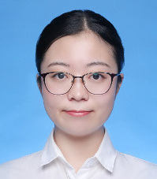

左逸楠，籍贯内蒙古鄂尔多斯市，现为长江大学地球科学学院硕士研究生，主要研究方向：摄影测量与遥感。

|     | 学校 | 院系  |  专业  |  学位  |
| :-----: | :------: | :-----:  | :-----: | :-----: |
| 2018.9-至今    | 长江大学 | 地球科学学院   |  地质工程  | 硕士  |
| 2014.9-2018.7    | 山东农业大学 | 资源与环境学院   |  地理信息科学  |  本科 |

> * Email: <591662722@qq.com>
