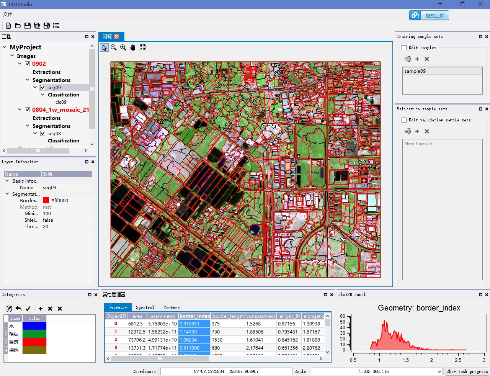

------

<!-- toc -->

# 系统介绍

``CDTStudio``是一个遥感影像面向对象分析与变化检测桌面应用程序，计划采用GPL协议开源，基于Qt4框架，主要开发语言为C++，能跨平台编译运行（经过测试可以在Windows 7/8/8.1/10、Ubuntu 14.04/14.10、OpenSUSE 13.1等系统中编译运行）。CDTStudio采用Qt的插件机制（Plugin）开发，所有算法均以插件形式存在。系统已经已经实现了一套完整的面向对象变化检测框架，包含遥感影像分割、面向对象分析（OBIA）与分类（OBIC）、遥感影像变化检测、半自动地物轮廓线提取（Snakes）等功能，系统主界面如下图所示：

> * [项目主页](https://github.com/chenguanzhou/CDTStudio)
> * [项目文档](http://cdtstudio.chenguanzhou.com/en/latest/)

# 截图

# 系统功能

> **应用框架：**
  + 影像分割框架
  + 属性计算框架
  + 面向对象监督分类框架（包括样本选取、精度评定）
  + 分类结果决策融合框架
  + 半自动地物提取框架
  + 面向对象变化检测框架
  + 基于像素变化检测框架  

> **可视化、交互功能:**
  + 影像层对比度增强显示
  + 影像层显示波段选择
  + 图层透明度选择
  + 多边形矢量样式选择
  + 属性数据显示
  + 属性数据直方图可视化
  
> **实现算法**
  + 影像分割：
      + 基于图论最小生成树分割
  + 特征属性计算：
      + 光谱特征
      + 几何特征
      + 纹理特征
  + 分类算法：
      + KNN
      + Bayes
      + AutoSVM
      + SVM
      + ANN
      + RT
      + ERT
  + 矢量变化检测：
      + 叠置分析
  + 决策融合算法：
      + 投票法
  + 基于像素变化检测算法：
      + 差值法
  + 自动阈值算法：
      + OTSU
  + 半自动地物提取：
      + Snakes算法
	  + GrabCut算法
	 
# 第三方开源库

> * [Qt](https://www.qt.io/)
> * [QGIS - A Free and Open Source Geographic Information System](http://www.qgis.org/en/site/)
> * [GDAL - Geospatial Data Abstraction Library](http://www.gdal.org/)
> * [boost](http://www.boost.org/)
> * [QPropertyEditor](https://github.com/chenguanzhou/QPropertyEditor)
> * [OpenCV](http://opencv.org/)
> * [STXXL: Standard Template Library for Extra Large Data Sets.](http://stxxl.org/)
> * [Qwt - Qt Widgets for Technical Applications](http://qwt.sourceforge.net/)
> * [Log4Qt](http://log4qt.sourceforge.net/)
> * [Qt Solutions](https://qt.gitorious.org/qt-solutions)
