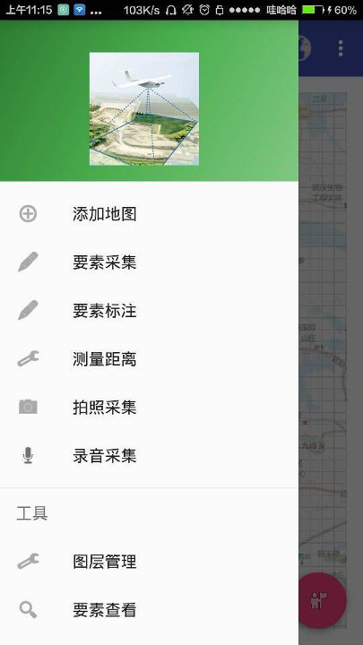
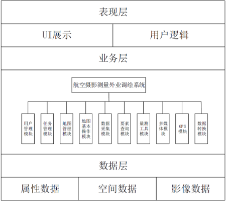
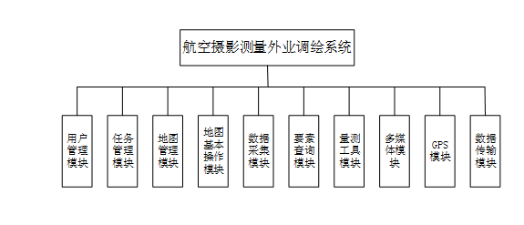

<!-- toc -->

# 系统简介

航空摄影测量外业调绘系统V1.0 基于ArcGIS Runtime SDK for Android平台、Android操作系统、SQLite关系数据库、Gdal图形库、集成开发环境选用Android studio 4.0和MS Visual Studio 2013。本系统实现了在PC端的数据拼接，提高了数据入库效率，缩短了作业周期。通过ArcGIS Runtime SDK for Android平台和Android操作系统的结合，设计并开发了一套航空摄影测量外业调绘系统，通过界面设计，数据库设计，用移动通信技术和GIS技术实现界面和数据库的内容交互。系统主界面如下图所示：

系统整体架构如下图所示：

# 系统功能模块

本系统功能模块共分为十个子功能模块，分别为用户管理模块、任务管理模块、地图管理模块、地图基本操作模块、数据采集模块、要素查询模块、量测工具模块、多媒体模块、GPS模块和数据转换模块，如下图所示：

# 运行环境及要求

> **用户界面**
  + 界面格式：采用Android系统最新流行界面，符合时代潮流，满足用户视觉感受和使用习惯
  + 屏幕格式：平板或大屏幕手机（5寸以上）
  + 文本显示：符合用户阅读习惯，文字信息一律采用宋体；日期统一采用年--月--日的格式如2015-11-11；错误信息一律采用弹出对话框形式，提示内容友好易懂  
> **硬件环境**
  + 内存为2G及以上的安卓移动设备  
> **软件环境**
  + 操作系统：Windows8.1、Android4.4
  + 数据库：Microsoft SQL Server2012、SQLite
  + 工具： Visual Studio2013、Android Studio2.3.7

