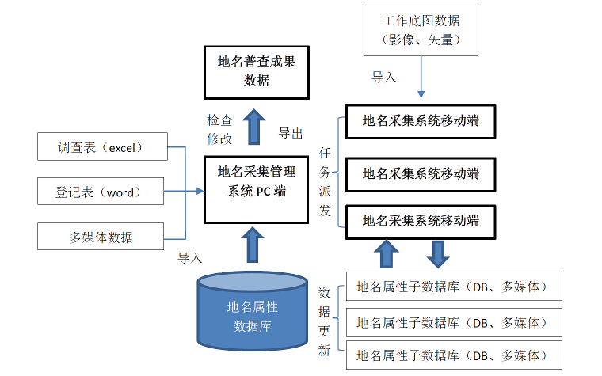
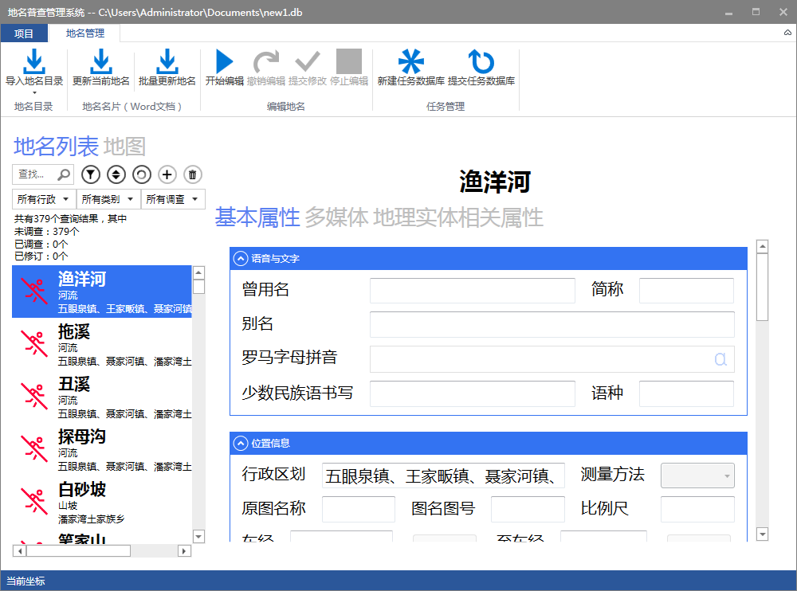
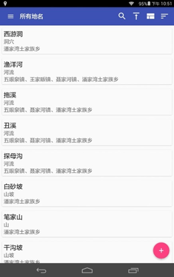

<!-- toc -->

# 系统介绍

地名数据处理系统分为采集管理、地名数据管理系统以及移动终端系统三个部分。其中，地名采集管理系统是区以上或主管部门使用，该系统基于ArcGIS数据对地名信息进行处理。输入数据主要包括矢量数据、遥感影像等基础地理信息数据和地名目录、地名数据等地名专题数据。地名目录主要指需进行采集的新增地名列表；地名数据主是当前已有的地名信息数据。地名数据管理系统主要提供给区以下或街道使用，其中不包括图形化的信息采集部分，只有对地名属性信息的管理和编辑功能，数据由移动终端和地名采集系统导入。移动终端系统用于地名普查人员外出实时采集处理数据。其中PC端输入数据主要包括工作底图数据、地名登记表（word）、地名目录调查表（excel），输出数据是地名普查成果数据，移动端主要输入数据包括工作底图数据、由PC端导出的子数据库（DB），输出数据更新后的子数据库（DB）以及多媒体数据。系统总体流程如下图所示：

# 地名信息采集管理系统

地名信息采集管理系统基于ArcGIS数据对地名信息进行处理，界面如下图所示：

> **主要功能包括**
  + 数据库设置
  + 数据管理
  + 系统操作
  + 图层控制
  + 视图显示控制
  + 地名数据处理
  
# 地名数据管理系统

地名数据管理系统主要提供给区级单位使用，其中不包括图形化的信息采集部分，只有对地名属性信息的管理和编辑功能。该系统主界面如下图所示：

> **主要功能包括**
  + 数据管理
  + 地名导入
  + 地名信息查询
  + 地名属性编辑
  + 地名数据导入
  
# 移动终端系统

移动终端运行于Android平板电脑，用于地名普查人员外出实时采集处理数据，功能界面如下图所示：

> **主要功能包括：**
  + 用户登录
  + 密码设置
  + 地图显示
  + 坐标定位
  + 距离和面积量算
  + 标注
  + WiFi数据传输
  
# 运行环境

> * 硬件环境：500G以上硬盘；2GB 以上内存
> * 软件环境：Windows XP以上操作系统；.NET Framework 4.5 ；Office Word 2013、Excel 
