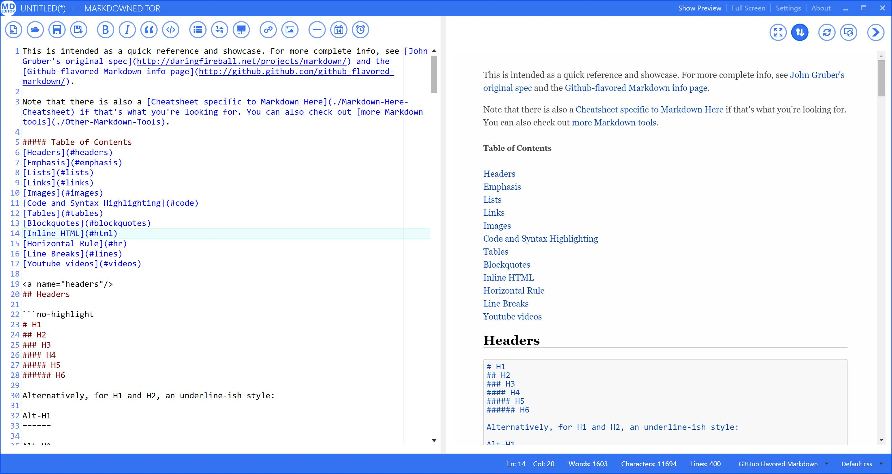

-----

<!-- toc -->

# 系统介绍

MarkDownEditor是一款免费开源的具有Metro风格的文本编辑器，采用WPF+MVVM模式编写，适用于Window7及以上版本。

> * [项目主页](http://chenguanzhou.github.io/MarkDownEditor/)
> * [项目文档](https://github.com/chenguanzhou/MarkDownEditor)

# 截图

# 系统功能

> * 支持Markdown，Strict Markdown，Github Markdown，PHP MarkdownExtra，MultiMarkdown，CommonMark等Markdown解析器，并可以动态切换
> * 中英双语界面，切换后重启生效
> * 可以隐藏预览（编辑模式），也可以隐藏编辑器（阅读模式）
> * 导出文件格式：
  + html
  + 带有css的html
  + rtf
  + latex
  + **pdf**
  + **docx**
  + **epub**  
> * 动态切换主题
> * 支持查找/替换
> * 支持上传本地图片
> * 支持自定义css以及css动态切换
> * 夜间模式
> * MathJax支持（仅限Markdown Processor，0.3.8新增）

# 第三方开源库

> * [Chromium Embedded Framework](https://bitbucket.org/chromiumembedded/cef)  
> * [CefSharp](https://github.com/cefsharp/CefSharp)
> * [qiniu csharp-sdk](https://github.com/qiniu/csharp-sdk)
> * [MahApps.Metro](https://github.com/MahApps/MahApps.Metro)
> * [Newtonsoft.Json](https://github.com/JamesNK/Newtonsoft.Json)
> * [AvalonEdit](https://github.com/icsharpcode/AvalonEdit)
> * [MVVM Light Toolkit](http://www.mvvmlight.net/)
> * [Imgur.API](http://imgurapi.readthedocs.io/en/latest/)
> * [SimpleHelpers.Net](https://github.com/khalidsalomao/SimpleHelpers.Net)
> * [UDE.CSharp](https://github.com/errepi/ude)
> * [WkHtmlToXDotNet](https://github.com/chenguanzhou/WkHtmlToXDotNet)
> * [The WiX Toolset](http://wixtoolset.org/)

 
