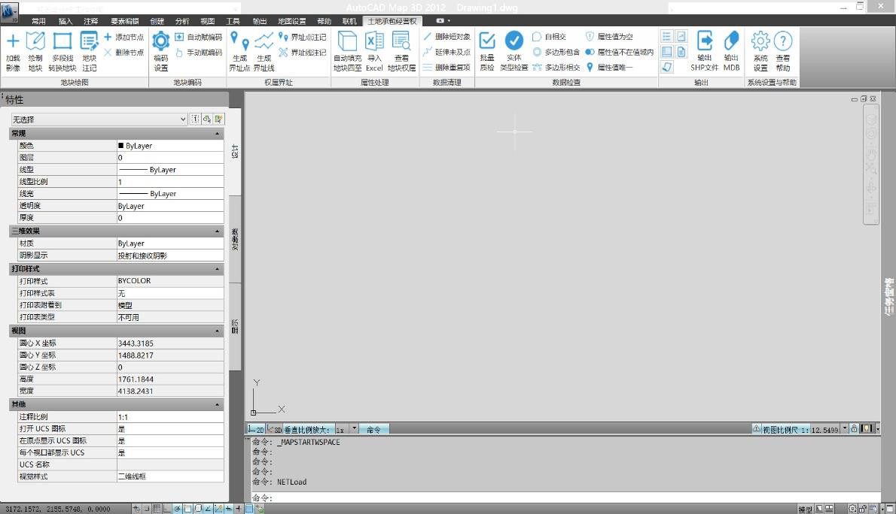
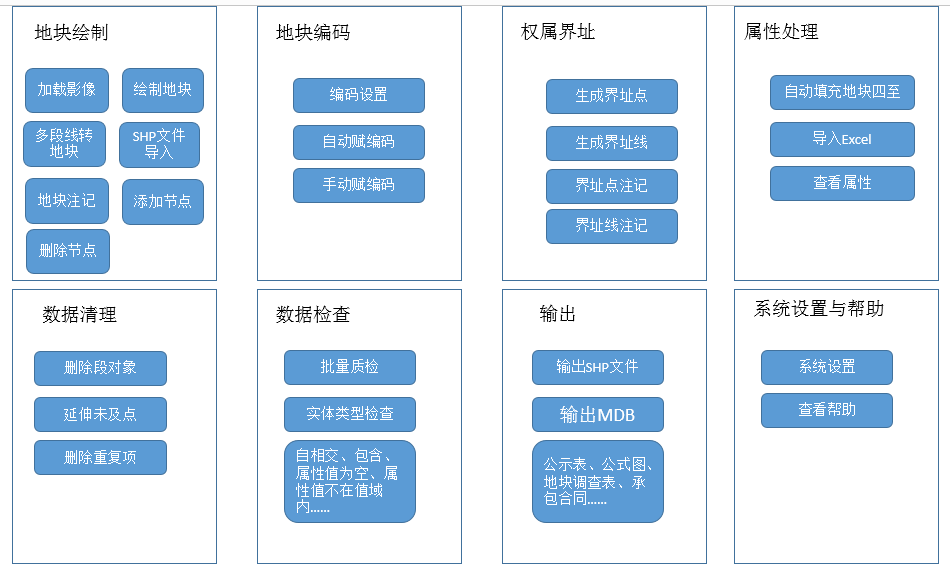
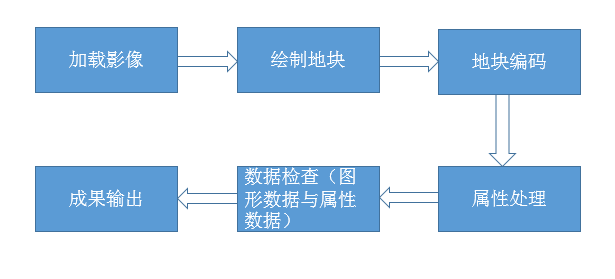

<!-- toc -->

# 系统介绍

农村土地承包经营权系统基于AutoCAD Map 3D 2012平台、SQL Server 2008关系数据库搭建，集成开发环境选用Visual Studio 2010 。其中 AutoCAD Map 3D平台负责基本的图形及空间数据处理、编辑以及数据转换和空间数据管理功能，SQL Server 关系数据库为系统数据存储容器，负责对空间数据和属性数据的存储和管理。
主界面如下：

# 系统功能简介

* 农村土地经营承包权系统实现地块绘制、地块自动编码、地块属性编辑处理、数据检查、成果输出等土地承包经营权调查确系统 需要的功能。系统在地块空间数据和属性处理完成后可以按要求自动将地块信息输出成各种地块确权信息图表格式（结果公示 表、土地承包权证登记簿、承包经营权公示图等），提高土地承包经营权确的工作效率，且避免了工作中的人为错误的发生。
* 农村土地承包经营系统需要实现从遥感影像的导入和权属调查信息录入、图形绘制、地块编码、数据检查、属性处理、成果输出等一体化的工作流程。因此农村土地承包经营系统设计了了地块绘图、地块编码、属性处理、数据清理、数据检查、成果输出和系统设置八个功能模块，系统各部分模块对应主要功能如下图所示：

  
# 系统工作流程

# 系统运行环境

> * 软件环境
  + Windows XP以上操作系统;
  + VS2013运行时;
  + Office Word和Excel  
> * 硬件环境
  + 500G以上硬盘；
  + 2GB以上内存