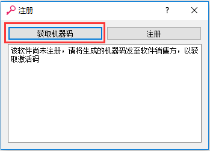
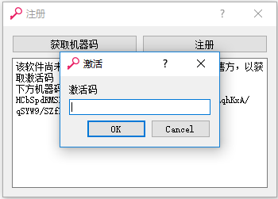
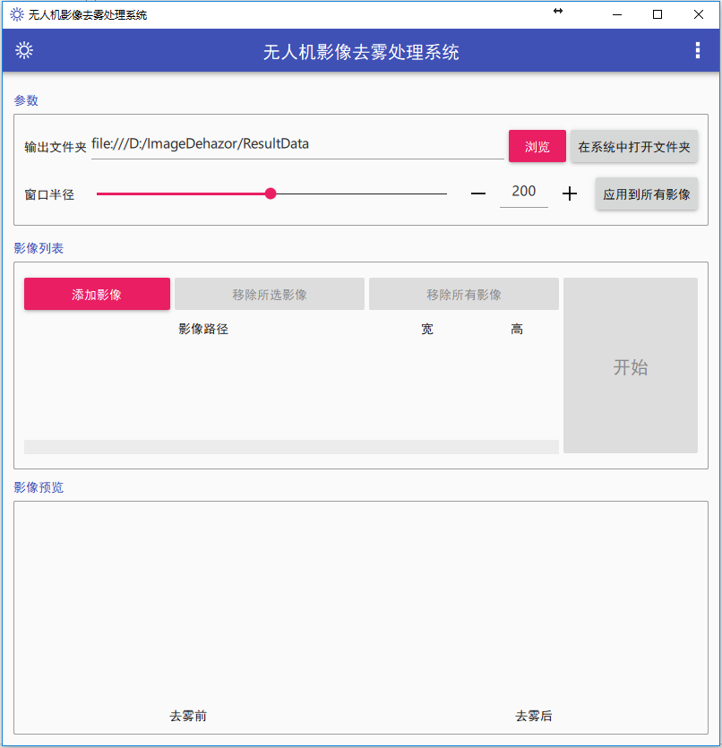
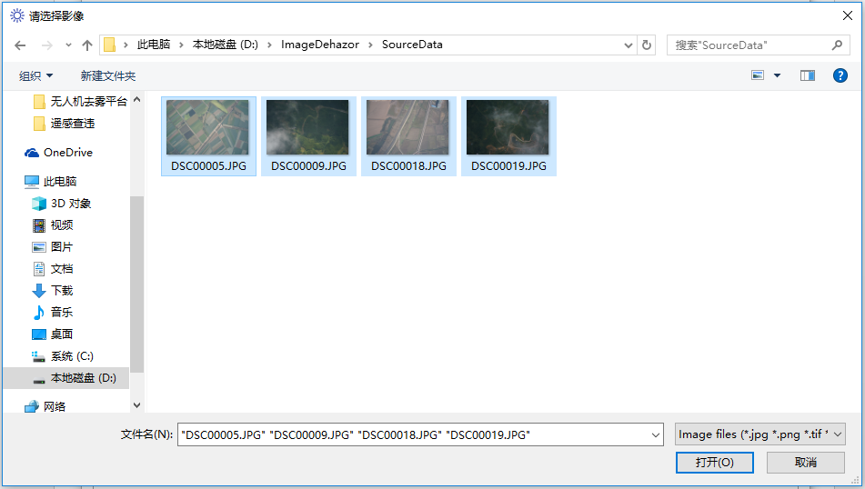
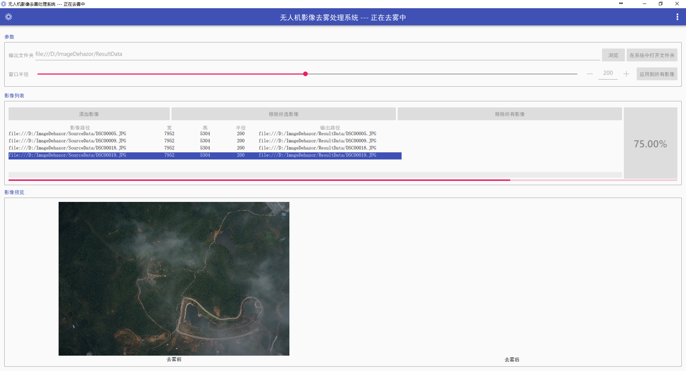
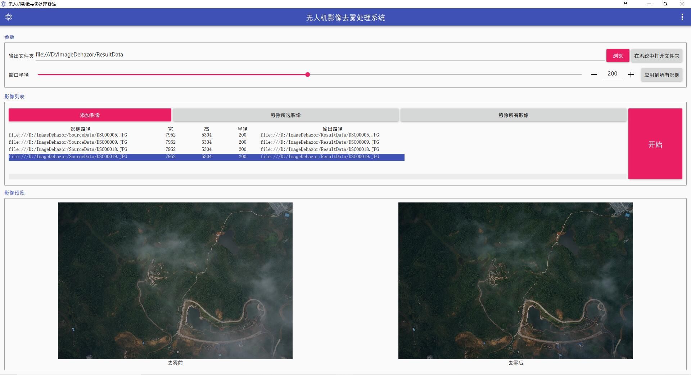

<!-- toc -->

# 获取免费软件

使用者从百度网盘 链接：https://pan.baidu.com/s/1htgH6ks  密码：f9kk 进行下载，下载完毕后进行解压，运行去雾软件文件夹中的 **ImageDehazor.exe** ，弹出如下图所示的界面，点击“获取机器码”按钮：

使用者将窗口中的 **机器码**、**使用者姓名**、**单位**、**用途**等信息以 **Word形式（网盘含有信息表文件）**发送至邮箱：<kunz_whu@qq.com>（邮件名称包含“去雾软件”）

获取注册码后点击上图的“注册”按钮弹出如下图所示的窗口：

将获取的注册码粘贴至激活码一栏中即可激活软件，软件主界面如下图所示：

# 添加影像

在主界面点击“添加影像”按钮，在弹出的对话框中选择要处理的无人机带雾影像，可同时选择多幅影像，如下图所示：

# 查看影像基本信息，选择输出结果文件夹

加载好影像之后，选择某一幅影像查看其基本信息，同时下方窗口会给出选中影像的预览图，若影像加载错误，可选中相应的影像，点击“移除所选影像”按钮将该影像移除或点击”移除所有影像“按钮删除所有影像。影像基本信息包括影像路径，宽、高、影像处理半径、输出结果路径等。默认半径值为200，用户可根据所处理影像效果拖动滑标或者手动输入数字调整窗口半径以获取较好的结果，调整完毕后可选择将参数应用至所有影像或所选影像。点击上方的“浏览”按钮可选择输出路径，注意输入路径跟输出路径要保证不同

# 影像处理及结果保存

影像加载完毕且确认无误后，点击“开始”按钮，程序开始进行处理，同时会显示当前处理进度，如下图所示：

# 查看结果

影像处理完毕后，结果自动保存在输出文件夹中，界面下方的窗口会同时给出去雾前后的预览图，用户可以选择某一幅影像双击在系统中显示，确认结果达到要求后，关闭软件即可。处理结果如下图所示：

# 说明

> * 无人机影像去雾平台V1.0由湖北富瑞尔科技有限公司与武汉大学CVEO小组共同研发。版权所有，并保留一切权利！
> * 您在使用过程中对本软件的功能、操作、界面等有更好的想法，欢迎您提出宝贵的意见，并发送至邮箱：<kunz_whu@qq.com>（邮件名称包含“去雾软件”）