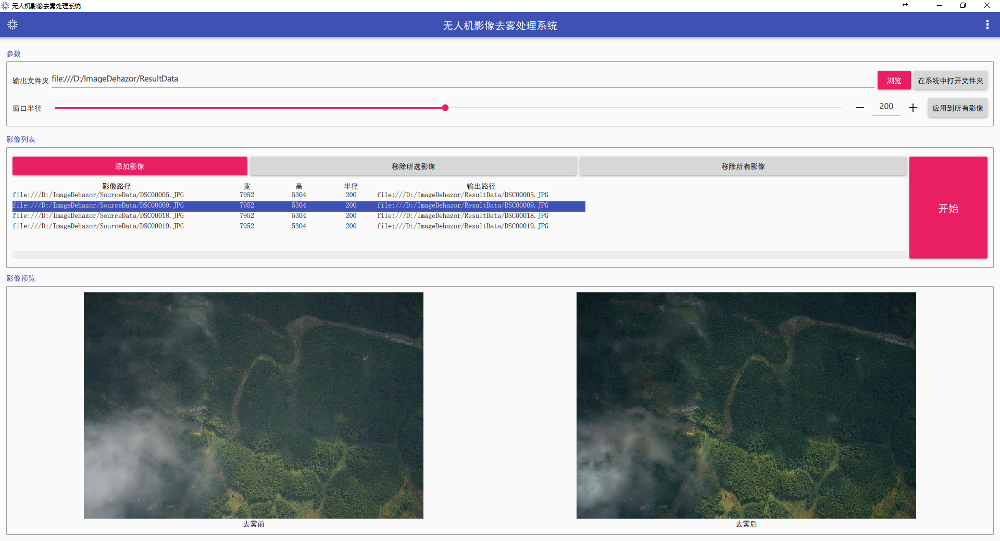
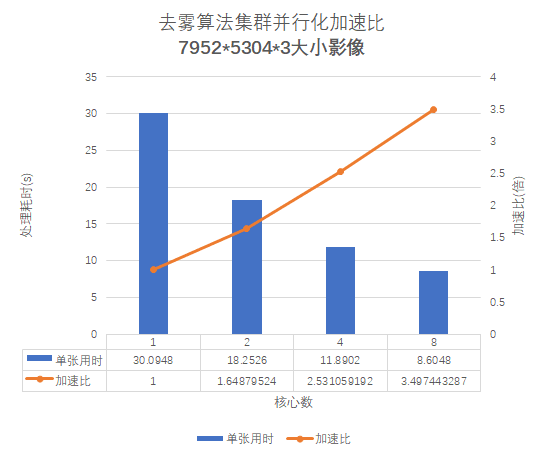
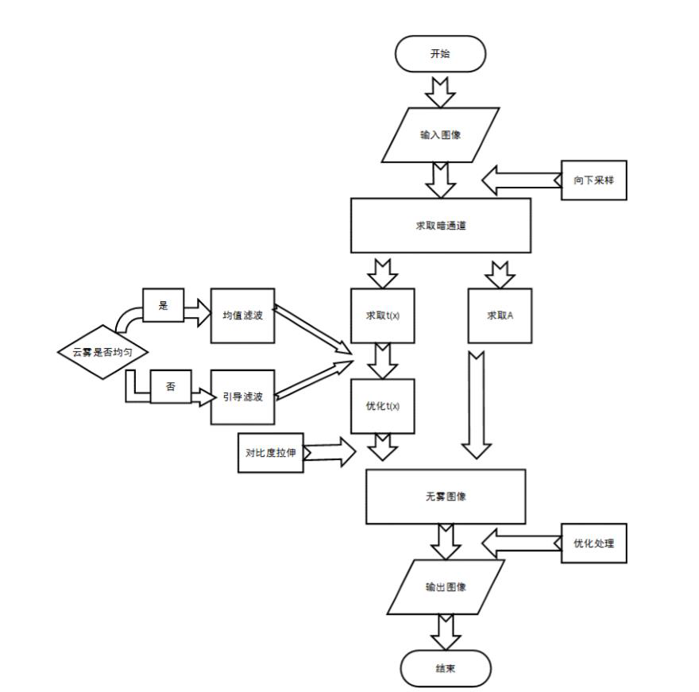

<!-- toc -->

### 无人机影像去雾平台操作说明书

> [无人机影像去雾平台操作说明书](guide)

### 平台简介

无人机图像去雾平台使用优化后暗通道先验的去雾算法，对无人机图像进行去雾处理，得到清晰的遥感图像。其中去雾算法使用C++语言编写实现，平台界面使用Qt设计，无人机图像去雾平台界面如下图所示：

在上述实验的基础上，为了更加高效的进行影像处理，平台进行了多核集群并行加速，并行实验结果如下图所示：

无人机图像去雾的流程如下图所示：

### 运行环境以要求

> * 硬件环境：8G以上内存，CPU主频2.4GHz以上；
> * 系统运行环境：Windows 7及以上
